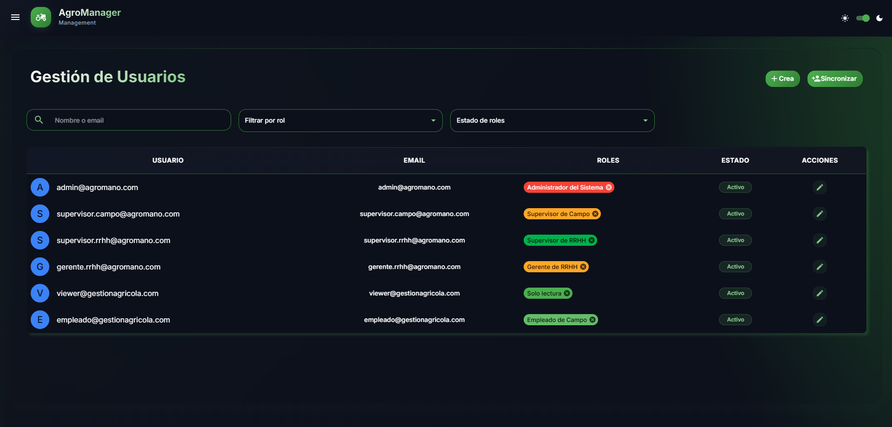

# Agromano

Sistema de Gestión Agrícola es una plataforma digital orientada a la administración eficiente del personal en fincas agroindustriales. Permite registrar y monitorear la asistencia de los trabajadores, planificar turnos y asignar tareas según la temporada y la demanda de trabajo. Además, incorpora el cálculo automático de pagos basado en horas laboradas o productividad, y genera reportes de eficiencia laboral y costos operativos, facilitando la toma de decisiones y optimizando la gestión de recursos en las operaciones agrícolas.

## Ejemplos Visuales

